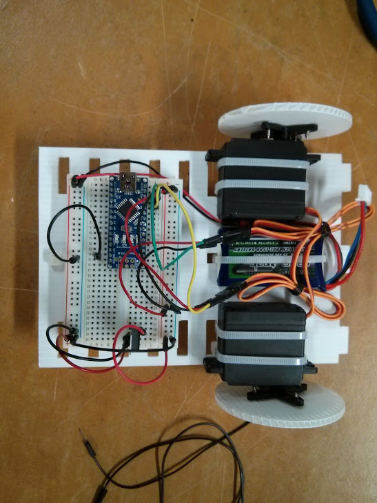
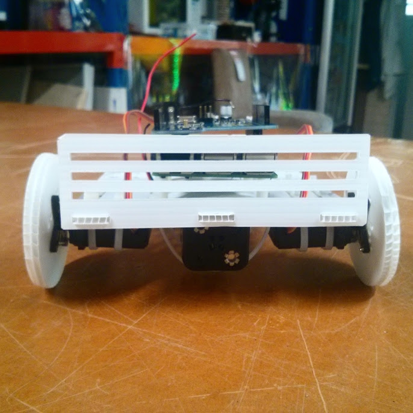

# NodeBots - CMBJS

| Time             |                                                                                                                                 |
|---------------|------------------------------------------------------------------------------------------------------------------------------------|
| 08:00 - 09:00 | Registration and device setup                                                                                                      |
| 09:00 - 09:10 | Welcome from SLASSCOM - by Indaka Raigama                                                                                          |
| 09:10 - 10:00 | Keynote - Prof. Rohan Munasinghe                                                                                                   |
| 10:00 - 10:40 | Case study 1 - Robotic Technologies at VEGA project                                                                                |
| 10:40 - 11:00 | Case study 2 - Pragmatic Robotics at Zone 24x7                                                                                     |
| 11:00 - 11:30 | REFRESHMENTS  11:00 - 11:10: Team 1-5 to visit VEGA                                                                                |
| 11:30 - 13:00 | Hands-on Lab Session - Creating a Nodebot Robot                                                                                    |
| 13:00 - 14:00 | LUNCH & Teams Vists Vega|
| 14:00 - 14:10 | Presentation on TRACE City Concept - by Dr. Harsha Subasinghe                                                                      |
| 14:10 - 16:00 | Hands-on Lab Session contd.                                                                                                        |
| 16:00 - 16:30 | REFRESHMENTS  16:00 - 16:10: Team 21 - 25 to visit VEGA                                                                            |
| 16:30 - 18:30 | Hands-on Lab Session contd. + Sumo Robot Competition                                                                               |
| 18:30 - 18:45 | Closing Remarks                                                                                                                              |

### Robot Kit Item List

* Ardiuno Nano
* Small Breadboard
* CR Servo motors (360 Degrees rotation) (DSC04-NFC)
* Ultrasonic Sensor
* AA 4 Batteries and Battery Holder
* Mini USB Cable
* Micro Switch (Bumper)
* Cable ties
* M-F Jumper wires 
* M-M Jumper Wires 
* Normal small wires- 10m 
* Small Switches
* 330 Ohm Resisters

###Stage I Robot

