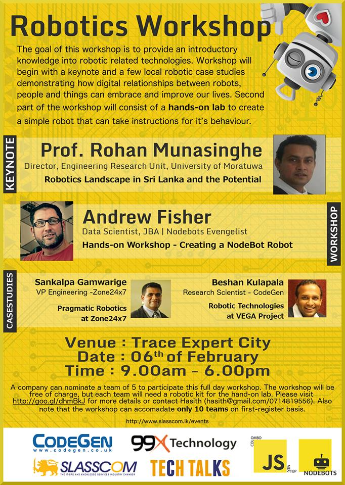

# NodeBots - CMBJS

###Agenda

| 8.00 - 9.00   | Registration and device setup                       |
|---------------|-----------------------------------------------------|
| 9.00 - 10.00  | Keynote - Prof. Rohan Munasinghe                    |
| 10:00 - 10:30 | Case study 1 - Robotic Technologies at VEGA project |
| 10:30 - 11:00 | Case study 2 - Pragmatic Robotics at Zone 24x7      |
| 11:00 - 11:30 | REFRESHMENTS                                        |
| 11:30 - 13:00 | Hand-on Lab Session - Creating a Nodebot Robot      |
| 13:00 - 14:00 | LUNCH                                               |
| 14:00 - 16:00 | Hand-on Lab Session contd.                          |
| 16:00 - 16:30 | REFRESHMENTS                                        |
| 16:30 - 18:30 | Hand-on Lab Session contd.                          |

### Robot Kit Item List

* Ardiuno Nano
* Small Breadboard
* CR Servo motors DSC04-NFC (360 Degrees roatation)
* Ultrasonic Sensor
* AA 4 Batteries and Battery Holder
* Mini USB Cable
* Micro Switch (Bumper)
* Cable ties
* M-F Jumper wires 
* M-M Jumper Wires 
* Normal small wires- 10m 
* Small Switches
* 330 Ohm Resisters

